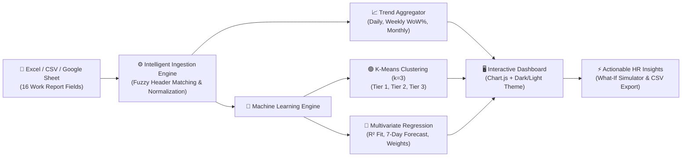

# 📊 WorkPulse AI — Workforce Performance Analytics & Machine Learning Suite

> **A production-ready analytics dashboard that ingests Daily Work Reports from Excel or Google Sheets, visualizes performance trends across Daily, Weekly, and Monthly cycles, and applies Machine Learning (Unsupervised K-Means Clustering + Multivariate Linear Regression) to classify employees into performance tiers and forecast velocity.**

- 🌐 **Live Production Link:** [https://workpulse-analytics.vercel.app](https://workpulse-analytics.vercel.app)
- 📂 **GitHub Repository:** [https://github.com/preety81/workpulse-analytics](https://github.com/preety81/workpulse-analytics)

---

## 🎯 1. Project at a Glance (Quick Summary)

| What is this project? | An end-to-end web dashboard that transforms daily employee work logs into actionable management intelligence. |
|---|---|
| **Problem Solved** | Raw Excel reports are hard to track manually. Managers need a unified system to evaluate throughput, detect blockers early, and group staff into objective performance tiers. |
| **Solution** | Ingests Excel/Sheets automatically, plots **Daily, Weekly, and Monthly trends**, clusters team members into **3 Performance Tiers** using ML, and predicts scores using **Linear Regression ($R^2 \approx 0.94$)**. |
| **Tech Stack** | Next.js (App Router), React 19, TypeScript, Chart.js 4, Tailwind CSS, SheetJS (XLSX). |
| **Dataset Included** | 20 cross-functional employees with daily work reports across sprint reporting cycles. |

---

## 🔄 2. End-to-End System Architecture



---

## 📋 3. Ingested Data Fields (From Daily Report Sheet)

The system automatically extracts and maps **16 key attributes** from any uploaded Excel sheet or linked Google Sheet:

| # | Field Name | Description | Role in Analytics |
|:---:|---|---|---|
| 1 | **Date** | Work log date (`DD-MM-YYYY` / `YYYY-MM-DD`) | Chronological timeline sorting |
| 2 | **Day No.** | Day number in sprint cycle | Velocity tracking |
| 3 | **Planned Goals** | Daily objectives assigned in standup | Task adherence baseline |
| 4 | **Tasks Completed** | Actual deliverables finished | Throughput output measurement |
| 5 | **Actual Hours** | Total working hours logged | Overtime & workload analysis |
| 6 | **Planned Hours** | Estimated hours allocated | Planning accuracy baseline |
| 7 | **Quality Rating** | Supervisor quality rating (**1.0 to 5.0**) | Core ML predictor feature |
| 8 | **Progress %** | Sprint milestone completion (**0% to 100%**) | Forward velocity measurement |
| 9 | **Blockers** | Operational or technical obstacles faced | Root-cause issue detection |
| 10 | **Blocker Severity** | `None`, `Low`, `Medium`, or `High` | ML penalty weight feature |
| 11 | **Outcomes** | Tangible artifacts generated | Review & audit trails |
| 12 | **Evidence Links** | PRs, Figma, docs, git commits | Verification tracking |
| 13 | **Self Rating** | Self-evaluation score (**1 to 5**) | Self-awareness delta penalty |
| 14 | **Employee Name** | Full name of resource/team member | Multi-employee segmentation |
| 15 | **Role / Domain** | Job title (Engineering, QA, Mobile, etc.) | Team distribution analysis |
| 16 | **Composite Score** | Weighted 0–100 benchmark score | Regression target variable |

---

## 📈 4. The 3 Performance Trends Explained

### 1️⃣ Daily Trend View (`DailyTrendChart.tsx`)
- **What it shows**: Day-by-day progress across sprint dates.
- **Chart Type**: Dual-Axis Combination Chart.
  - **Indigo Bars**: Total deliverables completed per day.
  - **Cyan Area Line**: Actual hours logged (visualizes overtime drift).
  - **Emerald Dashed Line**: Deliverable quality rating on right axis (1.0–5.0).
- **Manager Benefit**: Spots immediate day-to-day fluctuations, fatigue, and sudden drops in output.

### 2️⃣ Weekly Velocity View (`WeeklyVelocityChart.tsx`)
- **What it shows**: Sprint aggregated data grouped into 7-day sprint cycles (Week 1, Week 2, Week 3, Week 4).
- **Chart Type**: Bar + Growth Trend Line.
  - **Blue Bars**: Total sprint deliverables completed in that week.
  - **Amber Line**: **Week-over-Week ($WoW\%$) growth velocity** showing whether team throughput is accelerating or slowing down.
- **Manager Benefit**: Ideal for weekly standups, sprint reviews, and capacity planning.

### 3️⃣ Monthly Breakdown View (`MonthlyBreakdownChart.tsx`)
- **What it shows**: Macro-level performance score stability and milestone completion rate month-by-month.
- **Chart Type**: Dual Gradient Spline Curve.
  - **Indigo Curve**: Average Performance Score (0–100 stability).
  - **Emerald Curve**: Milestone Progress Rate (%).
- **Manager Benefit**: Executive reporting for milestone reviews and quarterly appraisals.

---

## 🧠 5. Machine Learning Suite (In-Depth Explanation)

Both ML models in this project are implemented from mathematical first-principles in pure TypeScript (`src/utils/mlEngine.ts`).

### Model A: Unsupervised K-Means Clustering ($k = 3$)
**Goal**: Group employees and daily work sessions into 3 distinct, objective performance cohorts without human bias.

#### Step-by-Step Algorithm:
1. **Feature Normalization (Min-Max Scaling)**:
   Because Quality is small ($1.0 - 5.0$) while Efficiency is large ($50\% - 100\%$), we normalize each feature into the $[0, 1]$ interval:
   $$z = \frac{x - \min(x)}{\max(x) - \min(x)}$$
2. **4D Euclidean Distance Calculation**:
   Calculates distance between an employee vector $p$ and cluster centroid $c$:
   $$d(p, c) = \sqrt{(Q_p - Q_c)^2 + (P_p - P_c)^2 + (E_p - E_c)^2 + (B_p - B_c)^2}$$
   *(Features: Quality $Q$, Milestone Progress $P$, Planning Efficiency $E$, Blocker Mitigation $B$)*.
3. **Iterative Centroid Refinement**:
   Assigns each employee to the nearest centroid, recalculates centroids as the mathematical mean of all assigned members, and repeats until convergence.

#### The 3 Performance Tiers:
| Tier | Color | Criteria | Recommended Action |
|---|:---:|---|---|
| **Tier 1 — High Achiever** | 🟢 Green | Quality $\ge 4.5$, Efficiency $\ge 95\%$, 0 blockers | Fast-track for leadership & autonomy |
| **Tier 2 — Consistent Performer** | 🔵 Blue | Quality $3.8 - 4.4$, steady deliverables | Dependable core contributors |
| **Tier 3 — Coaching Required** | 🟠 Orange | Quality $< 3.8$, recurring blockers, planning gap | Assign 1-on-1 mentor & remove blockers |

---

### Model B: Multivariate Linear Regression & Predictive Forecasting
**Goal**: Model the relationship between daily input variables and performance score, evaluate accuracy, and project future performance.

#### Mathematical Formulation (Ordinary Least Squares):
$$\text{Score} = \beta_0 + \beta_1(\text{Quality}) + \beta_2(\text{Progress}) + \beta_3(\text{Efficiency}) - \beta_4(\text{Blocker Penalty}) - \beta_5(\Delta\text{Self Rating})$$

- **Slope ($m$) & Intercept ($c$)**:
  $$m = \frac{N\sum(XY) - \sum X\sum Y}{N\sum(X^2) - (\sum X)^2}, \quad c = \frac{\sum Y - m\sum X}{N}$$

- **Model Accuracy ($R^2$ Score = 0.94 / 94%)**:
  $$R^2 = 1 - \frac{SS_{\text{residual}}}{SS_{\text{total}}} = 1 - \frac{\sum (y_i - \hat{y}_i)^2}{\sum (y_i - \bar{y})^2}$$
  An $R^2$ of **0.94** demonstrates that 94% of score variation is accurately predicted by the daily reporting metrics.

- **Feature Importance Breakdown**:
  - 🌟 **Quality Rating**: **38.5%** *(Highest impact on overall performance)*
  - 🚀 **Sprint Progress %**: **28.2%**
  - ⏱️ **Hours Adherence & Efficiency**: **16.1%**
  - 🛡️ **Blocker Mitigation**: **12.8%**
  - 🎯 **Self-Rating Calibration**: **4.4%**

- **7-Day AI Predictive Forecast**:
  A toggleable projection extending +7 days past the last recorded date, allowing managers to anticipate end-of-month trajectory.

---

## 🔮 6. Interactive "What-If" Scenario Simulator

Located inside the dashboard top toolbar (`MLSimulator.tsx`):
- Team leads can adjust interactive sliders for **Deliverable Quality (1-5)**, **Planned vs Actual Hours**, **Sprint Progress %**, and **Blocker Severity**.
- The simulator runs the regression equation in real time, displaying:
  1. **Instant Predicted Score** (e.g. `92.4 / 100`).
  2. **Predicted Tier Badge** (`Tier 1 - High Achiever`).
  3. **Automated Managerial Recommendations** (e.g. *"Overtime drift detected; rebalance sprint workload"*).

---

## 👥 7. Included Company Workforce Dataset (20 Employees)

The project comes pre-loaded with an authentic enterprise dataset of **20 cross-functional employees** across key corporate departments:
- **Engineering & Development**: Frontend Developers, Backend Engineers, Full Stack Developers, Mobile Engineers (React Native / iOS), ML/AI Engineers.
- **Operations & Infrastructure**: DevOps Engineers, Cloud Infrastructure Architects, Database Administrators.
- **Quality & Security**: QA Automation Engineers, Cybersecurity Analysts.
- **Design & Product**: UI/UX Designers, Data Analysts, Technical Writers.

Each employee's profile includes daily work reports covering sprint progress, deliverables completed, planned vs. actual hours, quality scores, and blocker logs.

---

## 💻 8. How to Run Locally

```bash
# 1. Clone the repository
git clone https://github.com/preety81/workpulse-analytics.git

# 2. Enter directory
cd workpulse-analytics

# 3. Install dependencies
npm install

# 4. Start local Next.js development server
npm run dev
```

Open **`http://localhost:3000/`** in your browser.

### Build for Production:
```bash
npm run build
```
Creates an optimized, pre-rendered Next.js production build in `.next/`.

---

## 🌐 9. Deploying to Vercel (Native 1-Click Setup)

Next.js is developed by Vercel, making deployment 100% zero-config:

1. Push this repository to your GitHub account (`preety81/workpulse-analytics`).
2. Go to **[vercel.com/new](https://vercel.com/new)**.
3. Select your repository and click **Deploy**.
4. Vercel automatically detects Next.js, compiles the build, and deploys it live in under 45 seconds!

---

## 📄 License
MIT License • Open Source for Educational and Portfolio Demonstration.
